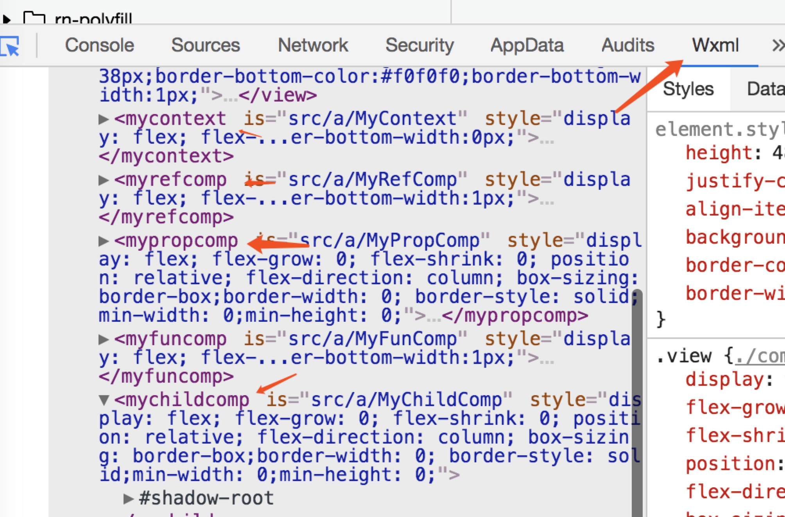

## 手动对齐

很方便，一般优先考虑使用。 但是当使用的第三方组件有如下的要求的时候：

1. 微信小程序端的展示和RN端本身就是不同的
2. 使用了RN原生动画api，而不是`wx-animated`，或者其他原生平台API
3. 原生扩展的组件
4. 需要更强的对组件的**控制**
5. 相比[命令转化](./第三方组件库扩展-命令转化.md)的微弱性能优势
6. 其他原因

这个时候就需要你手动的转化，就像RN给IOS， Android扩展原生功能一样，手动处理就是用小程序现有组件/API编写一个组件/API。 
虽然手动对齐对组件有了更强更细的控制，但是组件最终的能力还是取决并受限与微信小程序平台能力。 

下面我们以 `@areslabs/hi-rn` 为例说明，这个组件使用了RN的Animated做了一些动画， 我们将在微信小程序平台手动对齐一个`@areslabs/hi-wx`。
他们源码分别在 [@areslabs/hi-rn源码](https://github.com/areslabs/alita/tree/master/packages/Hi-RN), [@areslabs/hi-wx源码](https://github.com/areslabs/alita/tree/master/packages/Hi-WX)


执行`npm publish` 把`@areslabs/hi-wx`发布。 当RN项目使用`@areslabs/hi-rn`组件的时候，需要在其alita.config.js 配置如下： 

```javascript
module.exports = {
    dependencies: [
        {
            name: '@areslabs/hi-rn',
            wxName: '@areslabs/hi-wx',
            compLists: [
                {
                    name: 'Hi',
                    path: '/hi',
                    base: true  // <--- 手动对齐的组件，指定base
                }
            ]
        },
    ],
}
```

**注意** 手动对齐的组件，在配置的时候需要指定 `base：true`


### 使用效果

以后所有使用这个`@areslabs/hi-rn` 组件的 React Native 应用来说，就是可以直接转化为微信小程序版本了。

RN组件

```javascript
import App from '@areslabs/hi-rn'

class HelloWorld extends React.Component {
    render() {
    	return <View>
    	     <Hi/>
    	</View>
    }
}
```

转化之后的小程序组件效果:

```javascript
import Hi from '@areslabs/hi-wx'  // <--- 被替换为@areslabs/hello-wx

...
```

小程序定义组件引用的json文件，将根据`path: '/index'`， 生成如下json文件：
```json

{
	"component": true,
	"usingComponents": {
		"Hi": "@areslabs/hi-wx/hi"   // <--- 根据配置文件的path 生成json文件
	},
	"componentGenerics": {}
}
```


#### 具体对齐方式
下面我看下具体对齐方式

手动对齐的方式，基本上就是直接去写[微信小程序自定义组件](https://developers.weixin.qq.com/miniprogram/dev/reference/api/Component.html) ，不过存在一些差异。

我们先看下需要对齐的 `@areslabs/hi-rn`组件

```javascript
export default class Hi extends React.Component {

    state = {
        fadeAnim: new Animated.Value(1)
    }

    componentDidMount() {
        Animated.timing(
            this.state.fadeAnim,
            {
                toValue: 0,
                duration: 5000,
            }
        ).start();
    }

    render() {
        return (
            <View
                style={this.props.style}
            >
                <Animated.Text
                    style={{
                        ...this.props.textStyle,
                        opacity: this.state.fadeAnim,
                    }}
                    onPress={() => {
                        console.log('Hi ', this.props.name, ' !')
                        this.props.textPress && this.props.textPress()
                    }}
                >Hi {this.props.name}!</Animated.Text>
            </View>
        )
    }
}
```

##### *.comp.js

看一下[Hi-WX](https://github.com/areslabs/alita/tree/master/packages/Hi-WX)源码，除了小程序自定义组件需要的*.wxml, *.json *.js,*.wxss
之外，还多了一个*.comp.js 文件。 

在具体解释这个*.comp.js文件之前，我们先看一个事实。 

```javascript
class X {
    
    render() {
        return (
            <View>
                 <Y/>
                 <Y/>
            </View>
        )
    }
}
class Y {
    render() {
        return (
            <View style={{flex: 1}}>Y</View>
        )
    }
}
```
对于如上的结构组件，在React 实际渲染之后，实际如下：

```html
<View>
   <View style={{flex: 1}}>Y</View>
   <View style={{flex: 1}}>Y</View>
</View>
```

其中X， Y组件只存在JS阶段，不存在与实际渲染。 

但是微信小程序不是，小程序的自定义组件会退化为一个没有样式的节点：



上图是一个实际的微信小程序节点结构。

可见，在微信小程序上实际渲染出来的结构如下：

```html
<View>
    <Y>
       <View style={{flex: 1}}>Y</View>
    </Y>
    <Y>
       <View style={{flex: 1}}>Y</VIew>
    </Y>
</View>
```

问题来了，由于两种自定义组件的实现差异，这里将导致`flex： 1`属性失去其原本的意义。 

alita对上面产生的问题，提供了解决方法，具体的在我们对齐组件的时候，需要做一些配合框架的工作。回到`*.comp.js` 文件：

```javascript
import {RNBaseComponent, tackleWithStyleObj, styleType} from '@areslabs/wx-react'
const {VIEW} = styleType

export default class Hi extends RNBaseComponent{
    getStyle(props) {
        return {
            style: tackleWithStyleObj([props.style, styles.container], VIEW),
            textStyle: tackleWithStyleObj(props.textStyle),
        }
    }
}

const styles = {
    container: {
        borderWidth: 2,
        backgroundColor: 'yellow',
    }
}
```

第一： 组件class 继承自 RNBaseComponent
第二： 提供getStyle方法，这个方法, 提供React组件外层包裹元素的样式，比如`hi-rn`组件的包裹元素View的style属性如下：

```javascript

export default class Hi extends React.Component {
    ...
    render() {
        return (
            <View
                style={[this.props.style, styles.container]}
            >
            ...
            
```

对应这里的 getStyle，`style: tackleWithStyleObj([props.style, styles.container], VIEW)`。 

对于其他需要传递进来的style， 如`textStyle`，调用`tackleWithStyleObj(props.textStyle)` 即可。 不需要传递第二个参数。

`tackleWithStyleObj`会把React Native下的对象形式的样式转化为小程序平台下等效的字符串形式。 

大部分需要对齐的组件，包括原生扩展的组件，由于不存在对style的操作，其*.comp.js可以简单的定义如下：

```javascript
class XXX extends RNBaseComponent {
    getStyle(props) {
        return {
            style: tackleWithStyleObj(props.style, VIEW),
        }
    }
}
```

react-native的官方对齐，很多组件的*.comp.js 文件就是如上的定义。 可以参考其[源码](https://github.com/areslabs/alita/tree/master/packages/wx-react-native)


##### *.js

*.js文件是小程序自定义组件要求的四个文件之一，我们看下手动对齐下的`hi-wx`的js文件

```javascript
import {reactCompHelper} from '@areslabs/wx-react'

Component(reactCompHelper({
    properties: {
        name: null,
        textStyle: null,
    },
    ...
    methods: {
        handlePress: function () {
            console.log('Hi ', this.data.name, ' !')
            this.data.textPress && this.data.textPress()
        }
    }
}));
```

这个文件 没有什么特别的，唯一和直接写小程序组件不同的是，使用了 `reactCompHelper` API。 这个API做了两件事

1. 让这个微信自定义组件正确的和alita交互
2. 赋予这个自定义组件 data，访问函数的能力。 所有在 `handlePress` 下，我们可以看到 形如这种的调用。 `this.data.textPress && this.data.textPress()`
   这在原本的微信小程序上是不能做到的
   
##### *.wxml

*.wxml文件是小程序自定义组件要求的四个文件之一，我们看下手动对齐下的`hi-wx`的wxml文件

```html
<block>
    <view style="{{textStyle}}" catchtap="handlePress">Hi {{name}}!</view>
</block>
```  

正如前文所说，微信小程序自定义组件本身会退化为一个view节点，所以这里外层的view可以用block替代，或者直接去掉，

另外，由于RN的事件并不会冒泡，这里使用`catchtap`， 关于小程序 bind和captch的区别，详见[这里](https://developers.weixin.qq.com/miniprogram/dev/framework/view/wxml/event.html#%E4%BA%8B%E4%BB%B6%E8%AF%A6%E8%A7%A3)

